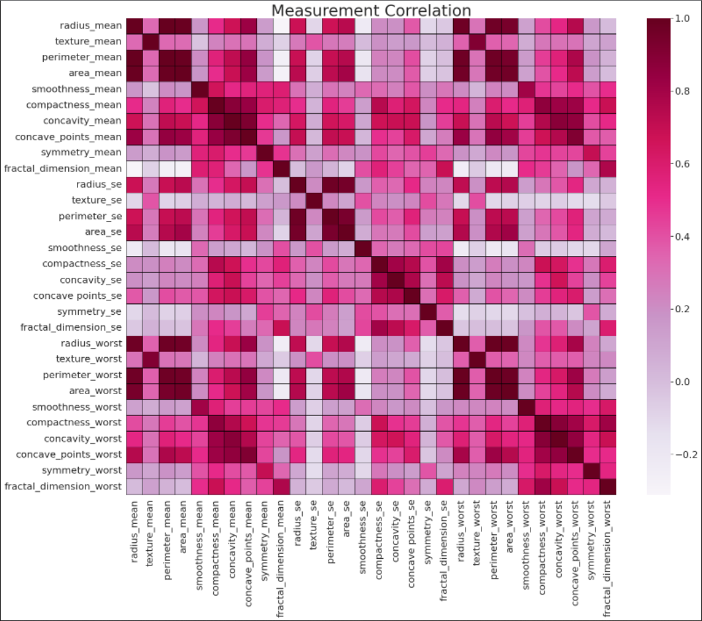

# Overview:

The purpose of our machine learning model is to create an effective breast cancer prediction system that allows people
to identify whether their tumor is benign or malignant. We chose this topic to create awareness about the dangers of
breast cancer and help identify a cancerous tumor in the early stages. Our goal is to enable individuals to identify
whether their tumor is benign or malignant based on the tumor’s characteristics such as size, compactness, and concavity.
The source data used in our machine learning model is data from 569 Fine-Needle Aspirate (FNA) samples from breast tumors,
with records of 10 cell nuclear morphology attributes, was taken from the University of Wisconsin. The question we
hope to answer using our machine learning model is, whether there were pairs of attributes that could accurately diagnose
breast tumor cell aspirates are benign(non-cancerous) or malignant (cancerous). The explanatory variable is the diagnosis
of the tumor cell (malignant or benign), and the predictor variables are radius (µm), texture (grayscale value),
perimeter (µm), area(µm2), smoothness (µm), compactness, concavity (µm), concave points, symmetry (µm), and fractal
dimension (µm), all of which are the mean values. If the majority of the tumor cells are malignant, then the tumor
is cancerous.
 
 
### Description of preliminary data preprocessing.
 
The dataset we chose for our machine learning needed only minimal changes to produce a clean dataset for us to analyze and come up with an agreeable topic. We dropped the ID column and any rows containing null values. Additionally, we changed the diagnosis column of ‘Benign’ to 1 and ‘Malignant’ to 2. Lastly, the original data set provided the mean, standard error, and the “worst” (the average of the largest three values). For the project, we agreed to only use the mean values for all the attributes.
 
### Description of preliminary feature engineering and preliminary feature selection, including the decision-making process.
 
Using Seaborn and Matplotlib, we were able to infer that feature to focus on using a heatmap.
 
The figure down below provides the correlation of all our features against themselves by shading does of high correlation closer to the color Purple and those with less correlation white or light red.
 

 
The results draw our attention to the hot spots where we can eliminate features that are vs themselves since those would clearly have a high correlation.
 
    These are the features we identified to have strong positive correlations:
    
    ·        Perimeter mean vs Radius mean
    
    ·        Perimeter mean vs Radius worst
    
    ·        Perimeter mean vs Area mean
    
    ·        Perimeter mean vs Area worst
    
    ·        Radius mean vs Area worst
    
    ·        Radius mean vs Area worst
    
    ·        Area mean vs Radius mean
 
### Description of how data was split into training and testing sets
 
We created a linear regression model and a logistic regression model with mean measurements. We then split the data into two-thirds for training and one-third for testing to prevent the model from overfitting. We used the training data to create a linear regression model and the testing data to verify the accuracy of the regression model by assessing its predictability of the model. The accuracy of the model was calculated by summing up the true positives and negatives and dividing by the number of all observations. The Linear Regression model achieved an 84.27% accuracy score which is acceptable. However, the logistic regression model scored a 97.09% accuracy score. Therefore, proving a Logistic Regression is a more reliable model to use to predict whether someone has cancer based on the list of features provided to the model.
 
 
### Explanation of model choice, including limitations and benefits
 
SciKitLearn will be used using a linear regression model to train and test the data. Our output labels will predict whether a breast tumor cell aspirates are benign(non-cancerous) or malignant (cancerous). The benefit of using linear regression is that while it is important to predict the clinical outcome of a patient, it is also important to quantify the influence of other features into account in an interpretable way. The linear regression model forces the prediction to be a linear combination of features, which is both its greatest strength and its greatest limitation. All of which makes for an interpretable model. Furthermore, linear models are easy to quantify and describe.
 
During our initial analysis, it occurred to us that cancer cells are often characterized by size. For that reason, we decided to drop the radius, perimeter, and area features from the dataset. Using the heatmap we looked for strong correlations between the size features. We then ran a logistic regression model to find out if there was any change in the outcomes. The new regression achieved an accuracy score of 93% which was only 4 points lower than the previous regression model. This revealed that size was not as important a factor in predicting whether the patient has a malignant or benign tumor. There are other factors in the dataset that are significant indicators of cancer. A more in-depth analysis would need to conducted to determine if using the majority of the features lead to the model being more accurate or if there are just a few that are significant indicators of cancer.
 
### Conclusion

After running both the logistic regression and linear regression it is clear there are other features in our dataset that provide a clear definition of benign and malignant cellular distinction. Our logistic model showed a drop in performance after removing all the features about cell size, the drop was only by about 4 points in accuracy. Similarily, the linear regression model dropped about 6 points in accuracy. At this time, we can accept that our data and logistic regression model appears to be working well to identify malignant cells from benign.

We conclude from the logistic regression model that breast tumor cell aspirates can be classified as malignant or benign with 97% accuracy given the cell nuclear morphology attributes of concave points, area, perimeter, and texture. In the model, the best pairs of attributes are area and compactness, concave points and texture, and concavity and radius. Although a more in depth analysis is required, the model is useful for visualizing how breast cancer cells can be distinguished as malignant or benign based on visual observations.  For future projects, we are interested in removing scaling and/or oversampling and testing the dataset’s resilience. As well as changing the ratio between test data vs training data. 

### Link to Presentation.
https://docs.google.com/presentation/d/12CxBT9FPjNfo_sVnSzCsloHxcBYDPzNQhJWn_YxaqM8/edit?usp=sharing
 
### Link to Dashboard
https://public.tableau.com/app/profile/kenny.rodriguez/viz/BreastCancer_16532846841690/Dashboard1
